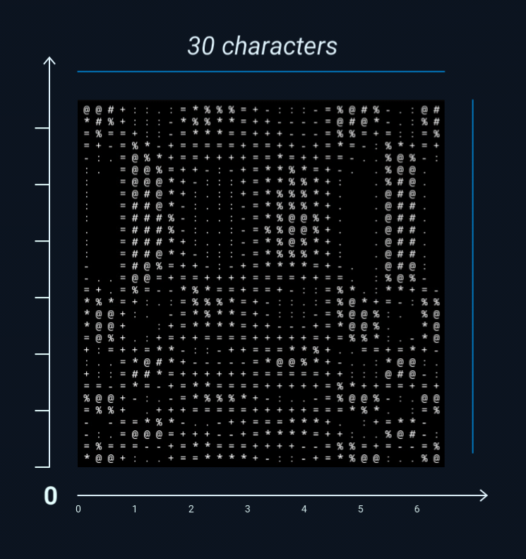

# About
**The following sections explain the salient parts of the program.**
## func()
The first thing that takes sight is ```func()``` - the surface function.

Value (float) returned by func() is taken as the z-coordinate of the point (x, y) passed to func(), i.e., the height of that point above/below the x-y plane.
Hence, func() defines the surface that is mostly spread across the horizon. There is another variable t for time, making the surface dynamic w.r.t time.

As a sidenote, I have found only periodic functions enjoyable - trigonometric and functions involving modulo.

## main()
**range and width**

range and size of the plot are initialised here.

```range``` is basically the area of the plot. For example, if ```range``` is set to ```6.5``` then plot will be of (0, 6.5) × (0, 6.5), i.e., a square of side length 6.5 units with its bottom left corner at the origin.

```width``` is for size of the plot, i.e., the number of characters in it. For example, if ```width``` is set to ```30``` (obviously an integer) then the plot will have (at most) 30 × 30 = 900 characters.



One may ask - *How can I get the plot for negative quadrants, for example, If I want the origin at the center of the plot?*
